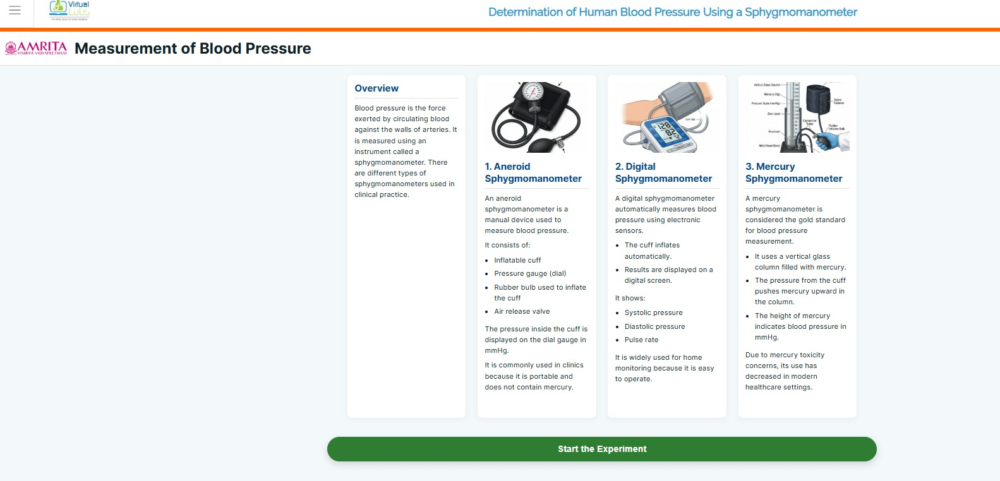
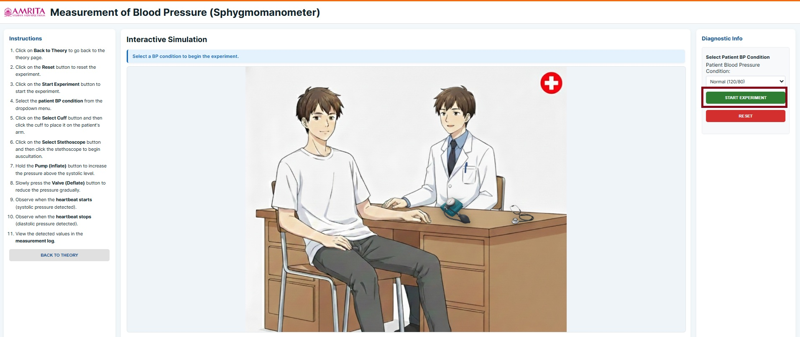
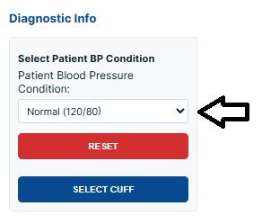
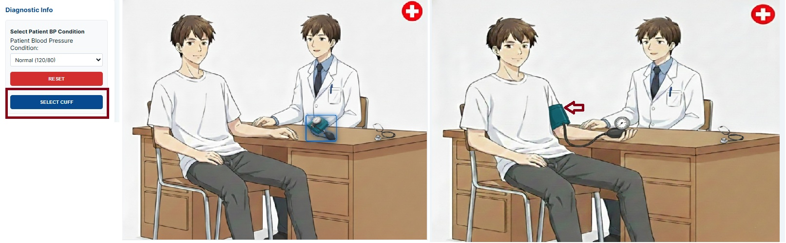
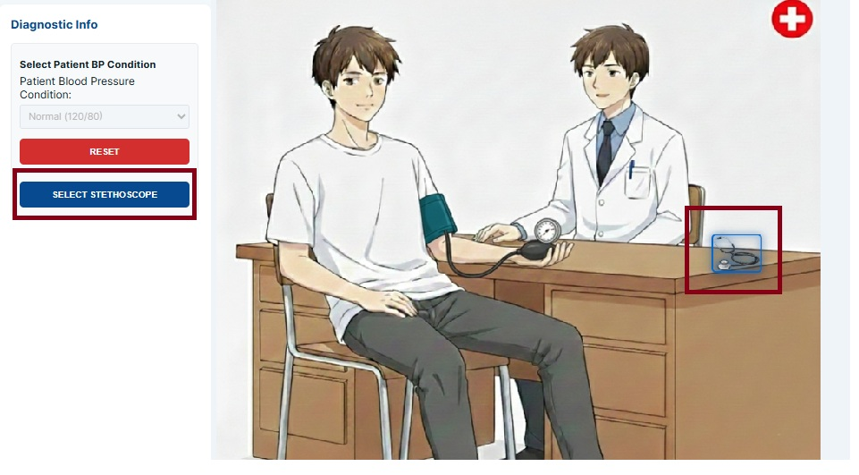
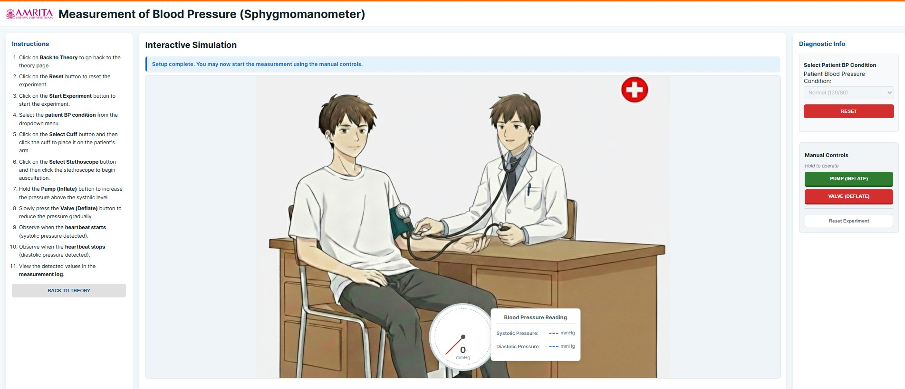
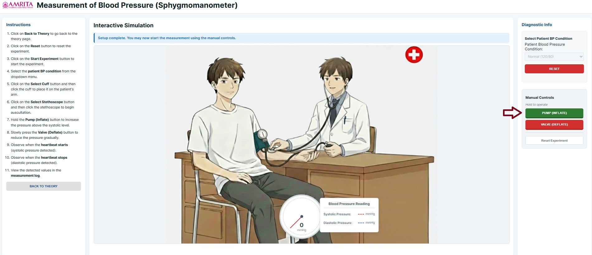
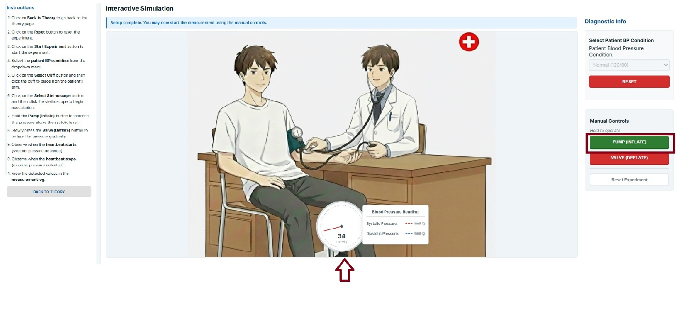
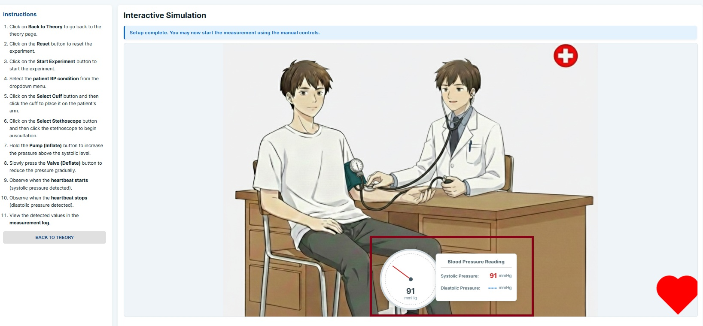
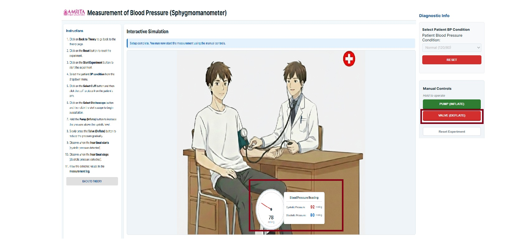

### Procedure

1. Click on the simulator tab to start working with the simulator, Determination of Human Blood Pressure Using a Sphygmomanometer.

2. The simulator page gives an overview of blood pressure and different types of Sphygmomanometers, parts and it clinical importance. Click on the " Start the experiment button to proceed to learn protocol for blood pressure measurement. 

  
   

&nbsp;

3. Users can observe the position for measuring Blood Pressure. Sit upright in a chair. Legs uncrossed and feet on the floor. Arm resting at heart level. The simulator page will give the user instructions to work out the experiment. Diagnostic information regarding blood pressure is also provided. Users must read the instructions carefully and click Start Experiment button.

  
   

&nbsp;

4. The user can select the BP condition from the dropdown menu. Here, as an example to work out the simulator, a normal healthy condition (120/80) is selected. 

  
   

&nbsp;

5. Then click on select cuff to place the cuff to measure BP. The cuff will get highlighted on the simulator screen. Click on the cuff to place it on the hand. The correct position is to keep the cuff right above the elbow on the bare arm.

  
   

&nbsp;

 
6. Next, click on the Stethoscope button to proceed to the Blood Pressure measurement. Click on the stethoscope image to place it on the physician's ear recording the subject’s blood pressure. 

  
   

&nbsp;

7. The user can observe how the physicians hold the stethoscope and sphygmomanometer exactly like a real-time scenario.

  
   

&nbsp;
 

8. Next, click on the PUMP (inflate) button to press the rubber bulb to inflate the cuff. From this step onwards, the user can use earphones to observe and learn about Korotkoff sounds. 

  
   

&nbsp;

 
9. While clicking continuously on the inflate button, the user can observe the BP measured on the dial.

  
   

&nbsp;

 
10. Inflate the cuff and slowly release the pressure. Note the reading on the gauge when the first heartbeat sound is heard. That measurement is the systolic pressure of the subject. 

  
   

&nbsp;

 
11. Next, click on the deflate (valve) button and continue to deflate the cuff slowly, and note the reading at which the heartbeat sounds disappear. This reading represents the diastolic blood pressure.

  
   

&nbsp;

12. Users can click on the reset button to repeat the simulation with different clinical conditions, such as hypotension, prehypertension, stage 1 hypertension, and stage 2 hypertension, and can observe the readings for clinical analysis
