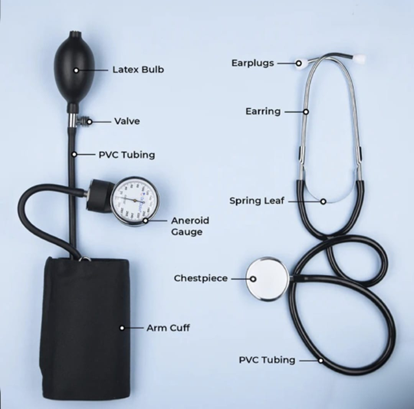

### Theory

Arterial blood pressure refers to the force of blood against the walls of the arteries when the heart pumps blood and relaxes. Clinically, the blood pressure is measured in two numbers, systolic blood pressure (SBP) and diastolic blood pressure (DBP). SBP is the degree of force exerted when the heart beats, and DBP is the pressure when the heart relaxes between beats. The blood pressure is measured in millimeters of mercury (mmHg). For example, if the systolic pressure is 120 mmHg and the diastolic pressure is 80 mmHg, the blood pressure is read as 120 over 80 and marked as 120/80.  Pulse defines the rhythmic expansion and contraction of an artery caused by the impact of blood pumped by the heart.  In clinical conditions, SBP and DBP are mostly reported as they are directly linked to risk factors associated with cardiovascular disease (CVD). The normal blood pressure range is around 120/80 mmHg. When the pressure drops below 90/60 mmHg, the condition is called hypotension (low blood pressure), and when the blood pressure is above 140/90 mmHg, it is called hypertension. When the range is 180/120 mmHg, it's dangerously high and needs medical care.

&nbsp;
A sphygmomanometer is the medical instrument used to measure blood pressure.  The term sphygmomanometer is originated from the Greek word “sphygmos,” meaning the beating of the heart, and “manometer,” which means a device for measuring pressure using dimensional analysis. It measures the blood pressure based on the force of the circulating blood in the blood vessels. Types of Sphygmomanometers included mercury, aneroid (mechanical dial), and digital blood pressure cuffs. The mercury/column sphygmomanometer is considered the "gold standard" for blood pressure measurement. It has a mercury-filled tube with manually inflatable cuffs with manual auscultation with a stethoscope. It provides accurate and durable reading without the need for frequent calibration. For measuring blood pressure, the instrument must be kept on a flat surface in an upright position with the inflatable cuff wrapped around the upper arm. The systolic and diastolic pressures were measured by listening for Korotkoff sounds with the stethoscope. The sphygmomanometer measures the blood pressure based on simple physics rule hydrostatic pressure equation. The hydrostatic pressure defines the pressure exerted by a fluid at rest at any point of time due to the force of gravity. It is calculated using the formula P = h × rho × g, where P indicates the pressure (in Pascals, Pa), h is the height of the mercury column (in meters) and ρ (rho) is the density of mercury, which is about 13,600 kg/m³. G is gravity, which is 9.8 m/s². Since the mercury is toxic, there were risk chances and banned its usage in some countries. Aneroid sphygmomanometers do not contain fluids, a mechanical device with an inflatable cuff, bulb, and dial gauge with a needle is needed to measure blood pressure. Digital blood pressure monitors are automated, convenient for usage at home, providing oscillometric readings of systolic/diastolic pressure and pulse rate. These new techniques were shown to be as accurate as the traditional mercury sphygmomanometer. 

&nbsp;
Various significant factors affect the blood pressure measurement, as the blood pressure is a variable haemodynamic phenomenon which is influenced by physiological and situational factors. The inherent variability of the blood pressure was reported during respiration process, emotion, physical exercise, meals, tobacco usage, alcohol consumption, temperature, bladder distension, pain, circadian variations, and in different age and race that must be considered for measurement. The body’s defence reactions fight or flight, phenomenon generally termed as the white-coat effect such as anxiety raises blood pressure and in such circumstances decisions in measurement need to be taken with utmost care. Posture of the subject need to be considered as there is a chance of increasing blood pressure if the subject is in a standing or lying position. The arm needs to be maintained at a horizontal level of the heart as denoted by the midsternal level.

&nbsp;
### Aneroid sphygmomanometer
An aneroid sphygmomanometer is a widely validated device clinically to measure blood pressure levels using a mechanical gauge that indicates the pressure exerted by the blood against the walls of the arteries. An aneroid sphygmomanometer is a portable device consisting of a dial gauge, cuff, and bulb, and is mercury-free, making it safer for clinical usage. It is used with a stethoscope to measure Korotkoff sounds, and reliable and accurate systolic and diastolic pressure readings will be provided. 

&nbsp;
Key components of an aneroid sphygmomanometer (Figure 1)

1. **Aneroid Gauge:** It is a circular dial with a needle, a non-liquid device that accurately displays the blood pressure.

2.	**Inflatable Cuff:** It is wrapped around the upper arm, and this bladder inflates to temporarily stop the flow of blood and then gradually releases the blood flow in the artery. The proper size of the cuff is essential as a too-small or too-large cuff can lead to incorrect blood pressure readings.

3.	**Inflation Bulb/Valve:** It pumps air manually into the cuff and releases slowly for accurate measurement. 

4.	**Stethoscope:** – Used to hear Korotkoff sounds.

&nbsp;

  
   
  <i>Figure 1. Parts of an aneroid sphygmomanometer</i>

&nbsp;
#### Working of Aneroid sphygmomanometer
Initially, the subject needs to be seated in a comfortable position for an accurate blood pressure measurement. Before the blood pressure measurement, the subject should be well rested for at least 5 minutes. The medical history of the subject can be taken at that time. It is necessary to avoid smoking at least 30 minutes before getting their blood pressure monitored. The subject should be seated with feet flat on the floor, slightly bent arm supported at heart level and seated with back support. The selection of an appropriate cuff size is the next step. The cuff size determination is based on bladder width, which is approximately 40% of the arm circumference, and bladder length will be 80% of the arm circumference. The center of the cuff bladder needs to be placed over the brachial artery. The cuff is wrapped around the arm approximately 2.5cm above the elbow crease. The clothing in the arm covers the location of cuff placement. Neither the subject nor the observer should talk during the rest period or during the measurement. 

&nbsp;
The aneroid sphygmomanometer works on the mechanical pressure measurement principle. When the rubber bulb is squeezed, the air enters the cuff, the cuff is inflated and compresses the brachial artery. Inflate the cuff to around 180–200 mmHg. This stops the temporary blood flow in the branchial artery. When the cuff is completely inflated, the air pressure acts on the metal diaphragm that is inside the gauge. The diaphragm expands or contracts (deforms) based on the applied pressure. This movement is transferred through a system containing mechanical levers and gears. The needle on the dial moves and shows the pressure in mmHg. When the cuff is deflated slowly by opening the valve, the pressure in the cuff gradually decreases, and the gauge needle moves downward. There will be turbulent blood flow with tapping sounds known as Korotkoff sounds, which can be heard by using a stethoscope placed over the artery. When the first Korotkoff sound is heard, read the needle value and record it as systolic blood pressure. When the sound disappears, note the needle value, which is reported as the diastolic blood pressure. The average readings of 2 readings obtained on minimum occasions can be used to estimate the individual’s BP.

&nbsp;
There are five phases of Korotkoff sound but only first sound (phase I, a clear, repetitive, tapping, coinciding with reappearance of a palpable pulse) and the sound disappearance (phase V, not really a sound, rather it indicates the disappearance of sounds) are of medical importance in arterial blood pressure measurement. In Phase 2 audible murmurs in the tapping sounds are heard and in Phases 3 and 4 Muted changes in the tapping sounds as the pressure measurement approaches the diastolic pressure. 

&nbsp;
For accurate measurements, the aneroid device needs to be calibrated periodically to ensure accuracy, as the mechanical components can drift over time. Aneroid sphygmomanometer is portable, durable, and safe for general check-ups.

&nbsp;
#### Blood pressure categories in medical conditions
• **Normal blood pressure:** Blood pressure is lower than 120/80 mm Hg.

• **Hypotension:** The force of the blood pushing against the artery walls is too low is called hypotension. The blood pressure is a reading lower than 90/60 mm Hg. The common symptoms include light-headedness, fainting, blurry vision, fatigue, dizziness, cold skin, and nausea. 

• **Prehypertension:** Blood pressure readings can be between 120 and 139 for the systolic measurement and 80 to 89 for the diastolic measurement. This acts as a warning for hypertension, cardiovascular diseases (CVDs), stroke, heart attack and associated complications in the future.

• **Hypertension:** Blood pressure in the arterial wall is highly elevated. The blood reading is between 130/80 mmHg or higher. It is a major cause of premature death, stroke, coronary artery disease, heart disease, hypertensive retinopathy, and chronic kidney disease if left untreated. 

o ***Stage 1 Hypertension:*** The blood pressure readings are between 130/80 and 139/89 mm Hg. This indicates the chances of cardiovascular disease and potential progression to stage 2 and can be managed by lifestyle changes and medications if preferred. 

o ***Stage 2 Hypertension:*** The blood pressure is consistently measured at a level of 140/90 mmHg or above. Increases the risk of stroke, heart attack, heart failure, and kidney damage. 

• **Hypertensive Crisis:** A hypertensive crisis is a sudden spike in blood pressure greater than 180/120 mmHg and requires immediate medical attention. It can damage blood vessels and body organs, including the kidneys, heart, brain, and eyes. 

• **Isolated Systolic Hypertension:** It is a type of high blood pressure, where the systolic blood pressure is in the range of 130mmHg or higher, and the diastolic pressure is lower than 80mmHg. It also increases the chance of heart attack, stroke, and death from cardiovascular disease.

• **Shock:** It is a sudden drop in blood pressure resulting in inadequate blood supply to the vital organs. The systolic readings is lower than 90 mm Hg, and the diastolic reading is below 60 mm Hg.
